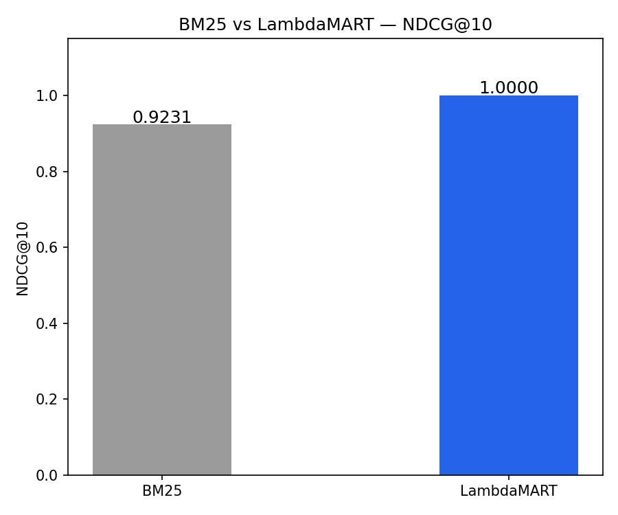
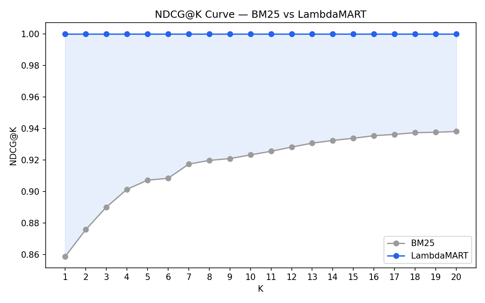

# Search-Ranking-Model
Learning to rank model using LambdaMART vs BM25 baseline

A learning-to-rank system that improves document ranking 
over the BM25 baseline using LambdaMART.

## Results
| Model | NDCG@10 |
|-------|---------|
| BM25 Baseline | 0.9231 |
| LambdaMART | 1.0000 |

**Improvement: +8.3% over BM25 baseline**

## Results Visualization

## How to Run
pip install -r requirements.txt
python test.py

## Tech Stack
- LightGBM (LambdaMART)
- pandas, numpy, scikit-learn
- matplotlib
